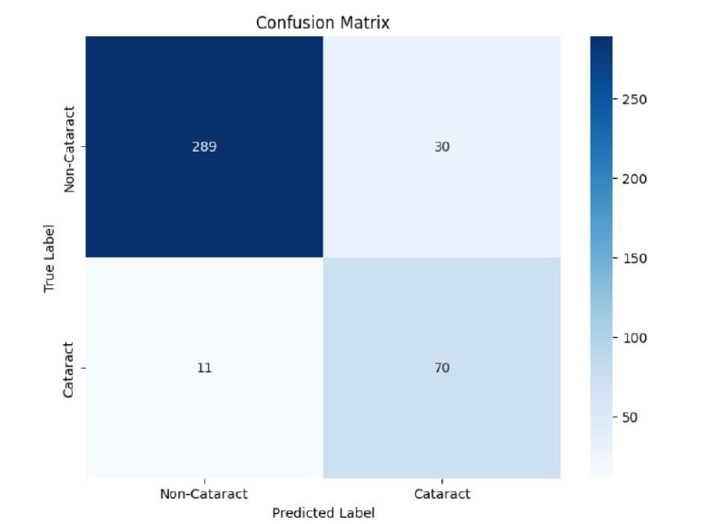

#  Cataract Detection Using Deep Learning

## Table of contents

- [Overview](#overview)
  - [Built with](#built-with)
  - [Dataset](#dataset)
  - [System Design](#system-design)
  - [Result](#result)
  - [What I learned](#what-i-learned)
  - [Useful resources](#useful-resources)
- [Author](#author)

## Overview

This project aims to leverage deep learning techniques, specifically the VGG19 architecture, to develop a robust system for automated detection of cataracts in human eye images. The goal is to provide a non-invasive, scalable, and cost-effective solution for early cataract diagnosis and improve ophthalmic healthcare accessibility.

## Built with

- Deep Learning Framework: TensorFlow, Keras
- Model Architecture: VGG19 Convolutional Neural Network
- Programming Language: Python
- Libraries: NumPy, Pandas, OpenCV, Scikit-learn
- Tools: Jupyter Notebook, Sublime Text

## Dataset

- The project utilized fundus images sourced from multiple publicly available datasets. The final dataset comprised images of cataract and non-cataract cases, curated to ensure diversity and balance. Details of the datasets and their preprocessing are as follows:

### Kaggle

- [Ocular Disease Recognition](https://www.kaggle.com/datasets/andrewmvd/ocular-disease-recognition-odir5k)
- [Cataract Dataset 1](https://www.kaggle.com/datasets/nandanp6/cataract-image-dataset)
- [Cataract Dataset 2](https://www.kaggle.com/datasets/jr2ngb/cataractdataset/data)
- [Eye Disease Classification](https://www.kaggle.com/datasets/gunavenkatdoddi/eye-diseases-classification)

### GitHub

- [Cataract Detection Dataset](https://github.com/krishnabojha/Cataract_Detection-using-CNN)

### Preprocessing Steps:

- Resized images to 224x224 pixels.
- Normalized pixel values to range [0,1].
- Applied data augmentation (rotation, scaling, and flipping) to address dataset imbalance and improve generalization.

### Data Augmentation:

- Random rotation up to ±30 degrees.
- Horizontal flipping.
- Scaling transformations.
- Resulted in the addition of 6000 augmented training images.

## System Design

### Input: 

- Fundus images (224x224 pixels, RGB).

### Data Preprocessing:

- Resizing images.
- Normalization between 0-1.
- Data augmentation techniques like rotation, scaling, and flipping to address dataset imbalance.

### Model:

- VGG19 architecture fine-tuned for binary classification.
- Uses ReLU activation and softmax for the final layer.
- Optimized using cross-entropy loss and Adam optimizer.

### Evaluation:

- Metrics: Accuracy, precision, recall, F1-score.
- Confusion matrix to analyze classification performance.

### Deployment:

- Can be integrated into healthcare systems for real-time diagnosis.

## Result

### Training Phase:

- Validation Accuracy: 90.56%
- Validation Loss: 0.2465
### Testing Phase:
- Test Accuracy: 84.25%
- Test Loss: 0.3846
### Confusion Matrix Analysis:

- True Positives: 289
- True Negatives: 70
- False Positives: 30
- False Negatives: 11

## What I learned

Through this project, I gained insights into:

- The importance of data preprocessing for improving model performance.
- Implementing and fine-tuning VGG19 for a medical imaging application.
- Challenges in addressing class imbalance and improving recall for minority classes.
- Evaluating and visualizing model performance using confusion matrices and classification reports.

## Useful resources

- [TensorFlow Documentation](https://www.tensorflow.org/) - The TensorFlow Documentation includes detailed API references, tutorials, and guides for building and deploying machine learning models. It also offers examples for beginners and advanced users, covering topics like deep learning, data processing, and model optimization.
- [Kaggle Datasets](https://www.kaggle.com/) - Provided diverse datasets for training and evaluation.
- [Research Papers on Cataract Detection](https://scholar.google.com/) - Guided the project's methodology and approaches.

## Author

- Website - [Satyaki Pal](https://www.linkedin.com/in/satyakipal2812)
